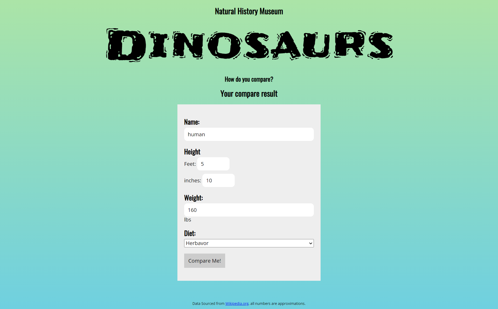
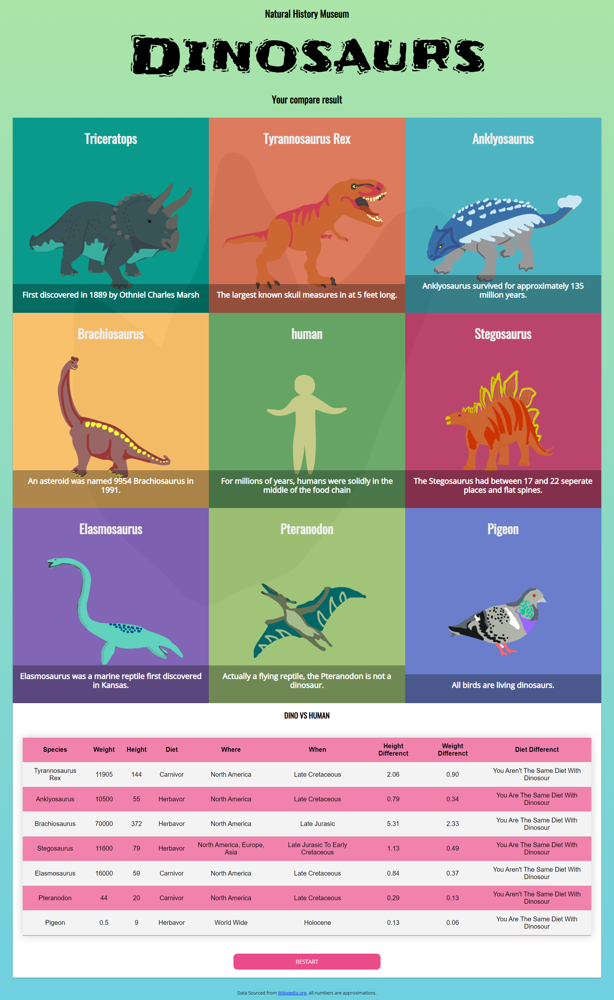

# Object Oriented Javascript 
## About project
This project is made to synthesize knowledge about Object-Oriented Javascript
## what it does
The project is an infographic that is derived from data that is provided, as well as user input data. Object-oriented javascript is great for working with complex data, but it’s not of much use without an interface to interact with. You will be pulling in information from a form and using it to complete an array of objects that will then be appended back to the DOM. 

## how to run it
You can run it by using live server (a visual studio code extension) or open index.html file by your browser

### Project Requirements

To complete this project, your UI must show the following:

- [x] The form should contain a button which upon clicking, removes the form
- [x] The button should append a grid with 9 tiles to the DOM with the Human located in the center
- [x] The Human tile should display the name of the person and an image, the dino tiles should contain the species, an image and a fact, the bird title should contain the species, image, and "All birds are Dinosaurs."

To complete this project, your backend code must:

- [x] Contain a class and all necessary objects
- [x] Contain at least 3 methods for comparing dinosaurs to the human
- [x] Get user data from the DOM
- [x] Append tiles with object data to DOM

### How it look
## Form search

## Search result
